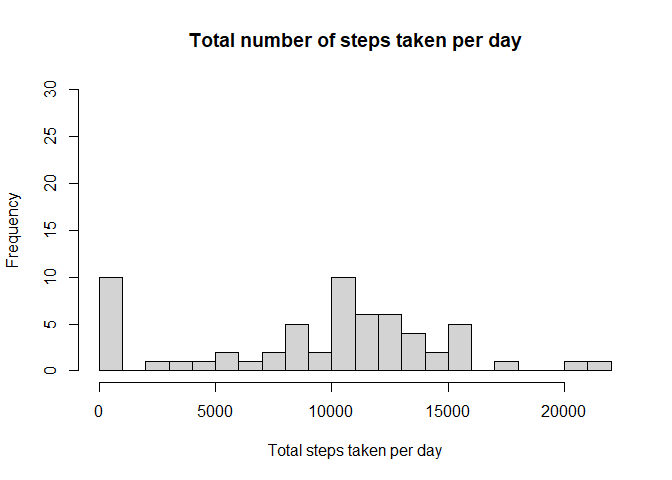
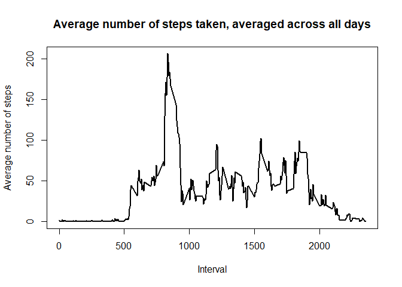
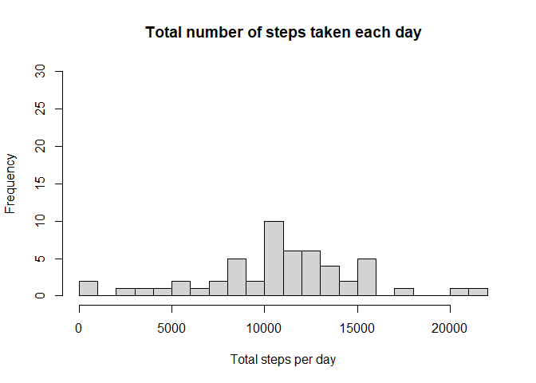
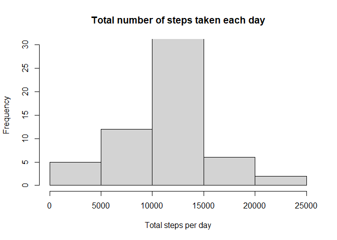
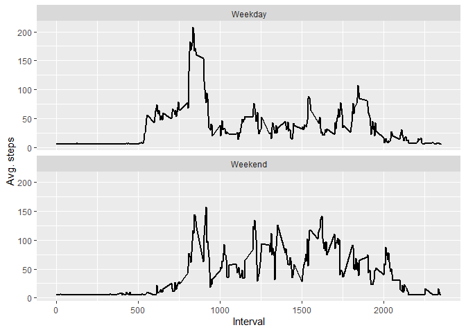

```r
getwd()
```

```
## [1] "C:/Users/tahuynh/Downloads/RepData_PeerAssessment1-master"
```


## Loading and preprocessing the data


```r
activity = read.csv("activity/activity.csv")
activity$date <- as.Date(activity$date, "%Y-%m-%d")
```


## What is mean total number of steps taken per day?

```r
total_steps <- activity %>% group_by(date) %>% summarise(total = sum(steps, na.rm = T))
```

```
## `summarise()` ungrouping output (override with `.groups` argument)
```

```r
hist(total_steps$total, main = "Total number of steps taken per day", xlab = "Total steps taken per day", ylim = c(0, 30), breaks = 20)
```

<!-- -->


```r
paste("Mean total number of steps taken per day: ", mean(total_steps$total,
                                                         na.rm = T))
```

```
## [1] "Mean total number of steps taken per day:  9354.22950819672"
```

```r
paste("Median total number of steps taken per day: ",median(total_steps$total, 
                                                            na.rm = T))
```

```
## [1] "Median total number of steps taken per day:  10395"
```


## What is the average daily activity pattern?


```r
average_daily <- activity %>% group_by(interval) %>% summarise(average = mean(steps, na.rm = T))
```

```
## `summarise()` ungrouping output (override with `.groups` argument)
```


```r
plot(average_daily$interval, average_daily$average, type = "l", lwd = 2, xlab="Interval", ylab="Average number of steps", main="Average number of steps taken, averaged across all days")
```

<!-- -->


```r
paste("Which 5-minute interval, on average across all the days in the dataset, contains the maximum number of steps?", average_daily[which.max(average_daily$average), ]$interval)
```

```
## [1] "Which 5-minute interval, on average across all the days in the dataset, contains the maximum number of steps? 835"
```


## Imputing missing values

```r
print("Table of missing data")
```

```
## [1] "Table of missing data"
```

```r
print(sapply(activity, function(x) sum(is.na(x))))
```

```
##    steps     date interval 
##     2304        0        0
```


```r
avg_value <- mean(average_daily$average)
activity_replace <- activity %>%
   mutate(replace_steps  = ifelse(is.na(steps), average_daily$average, steps))

activity_replace_hist <- activity_replace %>% group_by(date) %>% summarise(sum = sum(steps))
```

```
## `summarise()` ungrouping output (override with `.groups` argument)
```

```r
hist(activity_replace_hist$sum, xlab = "Total steps per day", ylim = c(0,30), main = "Total number of steps taken each day", , breaks = 20)
```

<!-- -->

```r
paste("Mean total number of steps taken per day: ", mean(activity_replace_hist$sum,
                                                         na.rm = T))
```

```
## [1] "Mean total number of steps taken per day:  10766.1886792453"
```

```r
paste("Median total number of steps taken per day: ",median(activity_replace_hist$sum, 
                                                            na.rm = T))
```

```
## [1] "Median total number of steps taken per day:  10765"
```


## Are there differences in activity patterns between weekdays and weekends?


```r
sum(is.na(activity$steps))
```

```
## [1] 2304
```


```r
missing_index <- is.na(activity$steps)
m <- mean(average_daily$average)
activity_imputed <- activity
activity_imputed[missing_index,1]<-m
activity_imputed_1 <- activity_imputed %>% group_by(date) %>% summarise(sum = sum(steps))
```

```
## `summarise()` ungrouping output (override with `.groups` argument)
```

```r
hist(activity_imputed_1$sum, xlab = "Total steps per day", ylim = c(0,30), main = "Total number of steps taken each day")
```

<!-- -->

```r
mean(activity_imputed_1$sum)
```

```
## [1] 10766.19
```

```r
median(activity_imputed_1$sum)
```

```
## [1] 10766.19
```


```r
activity_imputed$weekday <- weekdays(activity_imputed$date)
activity_imputed <- activity_imputed %>% mutate(day = ifelse(weekday=="Saturday" | weekday=="Sunday", "Weekend", "Weekday"))
```


```r
as.factor(activity_imputed$day)
```


```r
average2 <- activity_imputed %>% group_by(day, interval) %>% summarise(mean = mean(steps))
```

```
## `summarise()` regrouping output by 'day' (override with `.groups` argument)
```

```r
ggplot(average2, aes(x=interval, y=mean)) + 
       geom_line(size=1) + facet_wrap(~ day, nrow=2, ncol=1) +
       labs(x="Interval", y="Avg. steps") 
```

<!-- -->
